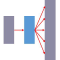

#  Words to Vectors APIs MSP Connector

## Description

A generated MSP connector for the Words to Vectors APIs API (version 1.0.1).

Generated from: https://api.apis.guru/v2/specs/apitore.com/wordsToVectorsApis/1.0.1/swagger.json 
Generated at: 2019-05-07T11:17:12+03:00

## API Description

Word to vectors. [Endpoint] https://api.apitore.com/api/10

## Authorization

This API does not require authorization.

## Actions

### Word2Vec wordvector

> Word2Vec JaWikipedia 2016-9-15 dump. Response &nbsp; Github: <a href="https://github.com/keigohtr/apitore-response-parent/tree/master/word2vec-response">word2vec-response</a> &nbsp; Class: com.apitore.banana.response.word2vec.WordVectorResponseEntity 

*Tags:* `word-2-vec-controller`

#### Input Parameters
* `access_token` - _required_ - Access Token
* `word` - _required_ - word

## License

flowground :- Telekom iPaaS / apitore-com-words-to-vectors-apis-connector 
Copyright © 2019, [Deutsche Telekom AG](https://www.telekom.de) 
contact: flowground@telekom.de

All files of this connector are licensed under the Apache 2.0 License. For details
see the file LICENSE on the toplevel directory.
